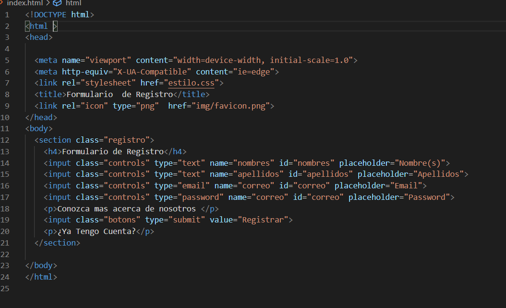
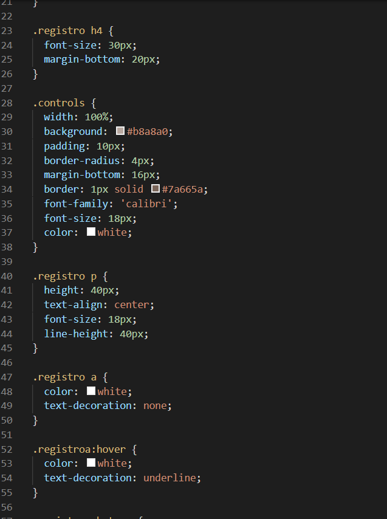
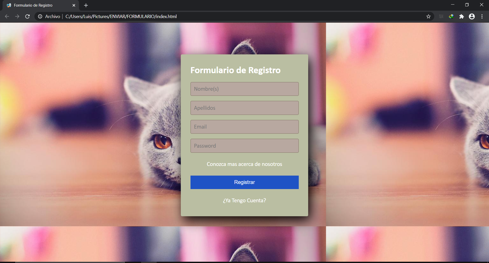
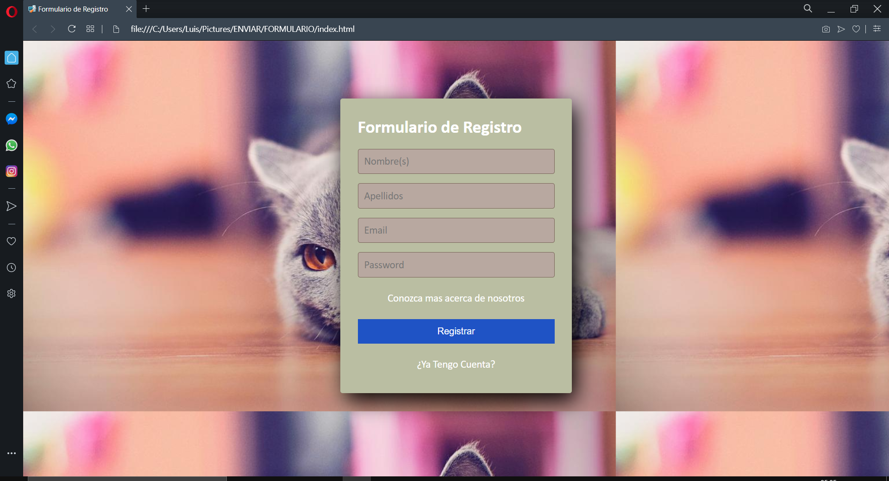
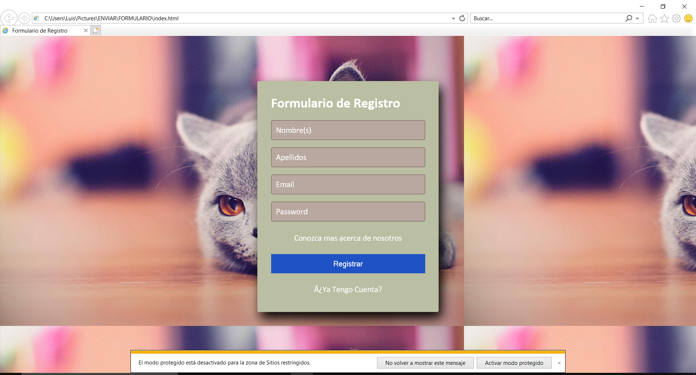
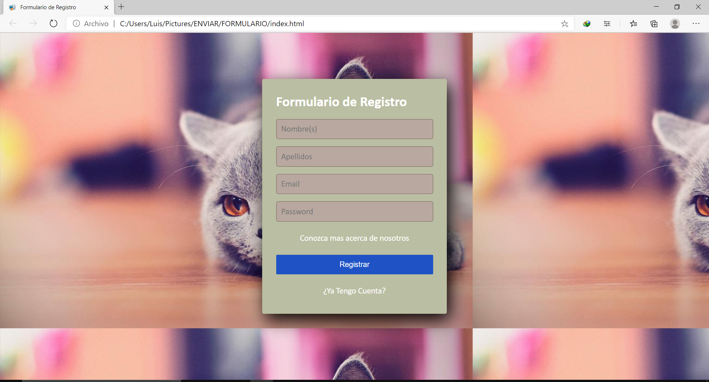

# Práctica 1. Portafolio
# Formulario
## Instrucciones
### Para poder visualizar este formulario tenemos que  entrar en la carpeta html de este repositorio y dar doble clic el archivo "index.html".
## Lenguajes de marcado
 ### Para la siguiente practica utilice  HTML y CSS, el editor utilizado fue Visual Studio code

#  Codigo  HTML

# Codigo  CSS

# Visualizacion 

## Google Chrome

### Utilizando Chrome

## Opera

###  Utilizando Opera

## Explorer

### Vista con Explorer

## Edge

